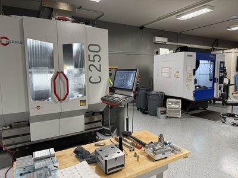

I figured since it was best to start off with a bit of an introduction post.
As far as the internet goes, I've been around since the first incantation of
blogging was using `finger(1)`.

I've been a software developer for nearly 30 years, primarily working at startups.
I worked the gamut of languages from ASP, ASP.NET/C#, Ruby, and Go. I was one of
the founding engineers at a company called Apcera during the PaaS boom. I had
been working with VMware' CloudFoundry before joing Apcera and working on their
platform and container technology just as Docker was starting to emerge, and later
Kubernetes taking over.

Most notably, I joined the team at Coinbase in early 2017 and stayed through
late-2021, after their IPO. Coinbase was an amazing experience. When I started,
they were around 120 people, when I left, it was like 2,500. I was on the
Infrasturcture team when it was just 5 people, and in the end it was 100-150
people. I worked built out a good chunk of their base operating system imaging,
AWS account provisioning, multi-account networking/linking, and so much more.

It was an amazing time, however with tht kind of transformation, it was a
completely different company. With the IPO, it afforded me a chance to take to
explore some other opportunities.

After many different startups and moving up through the ranks, I'd felt I'd kind
of peaked. I always preferred sticking to implementation rather than moving up to
design/architecting. Additionally you get pulled more and more into the business/
politics side of things. Fund raising, quarterly planning, KPIs, etc. No thanks.

So I left tech completely and after some exploring, ended up picking up CNC
machining. It wasn't completely out of the blue. My dad is a third generation
machinist, which would technically make me a fourth generation machinist now.

Machining isn't all that different. You produce Gcode, using a post processor
that is written in JavaScript. The post helps the CAD/CAM program produce Gcode
the specific machine can understand. You have fully parametrically
driven models to work with and tune. I simply went from building stuff digitally
to physically... still on the computer.

After 4 years though, I have been missing coding. I have dabbled in a few things
here and there, maintaining a moderately overkill homelab, but no major contributions.

This site is more to be an outlet for some bits that might be of interest to
others. I figure it is mostly to get indexed by search engines or AI and might
be a source of info for someone else. I don't have any grand plans or ideas of
what to work on, however most likely will be trying to dive into something new
rather than familiar.
